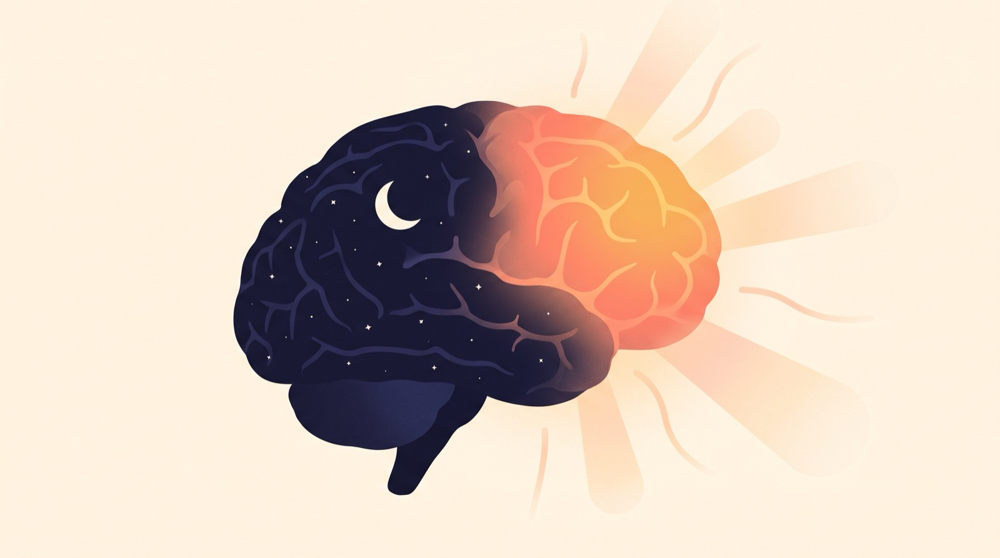

The alarm goes off. You silence it. At some point you answer a text, and later you have no memory of what it said, or of silencing the alarm at all. Twenty minutes after "waking up," you're staring into the fridge wondering what you came for.

None of that means you slept badly, and it definitely doesn't mean you're lazy. It means you were awake in the technical sense only. There's a name for this state, and it has a surprisingly deep research literature: **sleep inertia**, the transitional fog between sleep and actual alertness.

Understanding it changes how you think about mornings. Waking up isn't a switch. It's a boot sequence. And most of us are making decisions (driving, writing, joining meetings) while the system is still loading.

## Your brain doesn't turn on all at once

In 2002, researchers led by Thomas Balkin used PET imaging to watch brains in the act of waking up. The result is one of the most useful facts you'll ever learn about your mornings: consciousness comes back fast, but *alertness* doesn't. The brainstem and thalamus, the deep machinery that makes you conscious at all, reactivate within minutes. The **prefrontal cortex**, the region responsible for planning, judgement, working memory and self-control, takes another 20 to 30 minutes to catch up ([Balkin et al., *Brain*, 2002](https://pubmed.ncbi.nlm.nih.gov/12244087/)).

So for the first stretch of every morning, you are, quite literally, operating without your executive functions fully online. Your eyes are open. The CEO hasn't arrived yet.

How long the fog lasts varies. Classic work by Jewett and colleagues tracked performance after waking and found it recovers along a curve, with most of the improvement in the first hour ([Jewett et al., *Journal of Sleep Research*, 1999](https://pubmed.ncbi.nlm.nih.gov/10188130/)). A widely cited review puts the typical impairment window at **15 to 60 minutes**, stretching considerably longer after sleep deprivation or an awakening out of deep sleep ([Hilditch & McHill, *Nature and Science of Sleep*, 2019](https://pmc.ncbi.nlm.nih.gov/articles/PMC6710480/)). If you're running on a week of short nights, the fog gets deeper and lasts longer: chronic sleep restriction measurably magnifies inertia ([Sleep, 2019](https://pmc.ncbi.nlm.nih.gov/articles/PMC6519907/)).

## The person who dismisses your alarm isn't quite you

Here's the study that should worry anyone who trusts themselves at 6 AM. Researchers woke sleepers abruptly with a fire alarm and measured their decision-making. Performance didn't just dip. It was substantially degraded for at least **30 minutes**, and worst in the first three, exactly when the beeping thing demands a decision ([Bruck & Pisani, *Journal of Sleep Research*, 1999](https://pubmed.ncbi.nlm.nih.gov/10389091/)).

That's the core problem with ordinary alarms. Dismissing one is a decision, and it's being made by the version of you with the weakest judgement you'll have all day. Groggy-you will swipe an alarm away without forming a memory of it. Groggy-you sincerely believes the fifth snooze is different from the previous four. You're negotiating with someone who isn't fully there, and *you're* that someone.

Snoozing compounds it. Those nine-minute fragments aren't restorative sleep; they're shallow, broken dozing that can tip you back toward another sleep cycle, so the next alarm catches you descending instead of surfacing. You're not easing into the morning. You're re-running the worst part of it on a loop.

## What actually shortens the fog

Sleep inertia is physiology, so the honest framing is *shorten and manage*, not *eliminate*. Four levers have real evidence behind them:

1. **Light, immediately.** Bright, short-wavelength light after waking speeds the recovery of alertness. Researchers have measured the effect after both natural and simulated dawn ([Sleep, 2022](https://pmc.ncbi.nlm.nih.gov/articles/PMC9787581/)). Open the curtains before you open your inbox; outside beats every bulb you own.
2. **Movement, even briefly.** In one study, a **30-second** burst of exercise at waking measurably reduced inertia and kicked the cortisol awakening response into gear ([Journal of Sleep Research, 2022](https://pubmed.ncbi.nlm.nih.gov/34606883/)). It doesn't take a workout. It takes standing up and moving like you mean it.
3. **Caffeine, with honest expectations.** Caffeine genuinely counters inertia ([Sleep, 2001](https://pubmed.ncbi.nlm.nih.gov/11683484/)), but it needs roughly 20 minutes to hit your bloodstream. The first-sip revival you feel is mostly ritual. Good ritual! Just not chemistry yet.
4. **Cognitive load, on purpose.** The prefrontal cortex is the last region to wake, and it responds to being *used*. Working memory tasks (arithmetic, recall, sequencing) force blood flow and activation into exactly the circuitry that's lagging. It's the difference between waiting for the engine to warm up and actually driving.

## Where WakeSharp fits in (and where it can't)

WakeSharp was built around lever four. The alarm doesn't stop for a swipe, because a swipe is exactly what groggy-you does on autopilot. It stops for a **mission**: a math sprint, scanning an object or a barcode, or getting up and walking. Each one requires the kind of working-memory engagement that a half-booted prefrontal cortex can't fake, which is the point. By the time you've solved your way out, the boot sequence is genuinely further along. (On iPhone, alarms ring through Silent, Focus and Do Not Disturb; Android gets its own dedicated alarm stream. Grogginess shouldn't get a technicality to hide behind.)

Then comes the part we think matters most: **measurement**. A one-minute warm-up scores how sharp you actually woke against your own rolling baseline, because yesterday's you is the only benchmark that means anything at 6 AM. Sleep inertia is invisible from the inside; you can't feel how foggy you are, which is precisely the trap. A number can.

And the honest limits, because we'd rather say them than have you discover them: no app deletes sleep inertia, since it's your biology doing its job. Short sleep will still buy you a longer fog, missions or not. And no alarm on any phone is beyond your phone's own settings and battery, which is why WakeSharp checks alarm reliability the night before and tells you plainly (it will ring, it may not, or it cannot) instead of showing a comforting green tick it can't back up.

## FAQ

**How long does sleep inertia last?**
Typically 15 to 60 minutes for the worst of it, with measurable effects up to a few hours after waking from deep sleep or on a sleep debt. The first few minutes are reliably the most impaired, which is exactly when your alarm asks you to make a decision.

**Is sleep inertia a disorder?**
Everyday sleep inertia is normal physiology, not a condition. An extreme form (sometimes called sleep drunkenness, with prolonged confusion on waking) can accompany disorders like idiopathic hypersomnia. If waking up feels disabling most days despite adequate sleep, that's worth raising with a clinician; a blog post is not the tool for that job.

**Doesn't coffee fix it instantly?**
No. Caffeine is genuinely effective against inertia but takes around 20 minutes to act. The smart play is light and movement first, coffee as the second wave, not the rescue.

**Why is my grogginess so much worse some mornings?**
The two biggest levers are *which sleep stage you woke from* (deep sleep is the roughest exit) and *how much sleep you've been getting lately*. An erratic schedule also forces more deep-stage wake-ups. Consistency is boring and undefeated.
